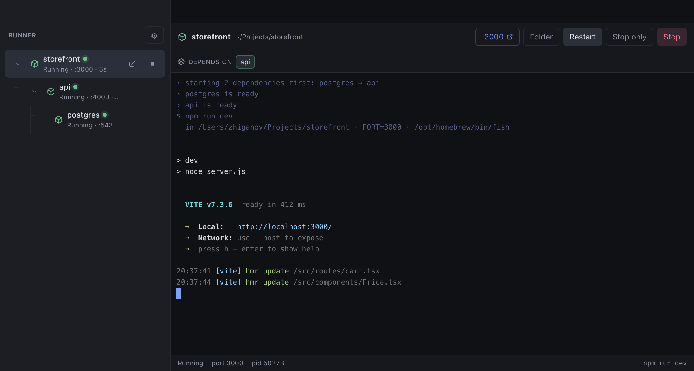
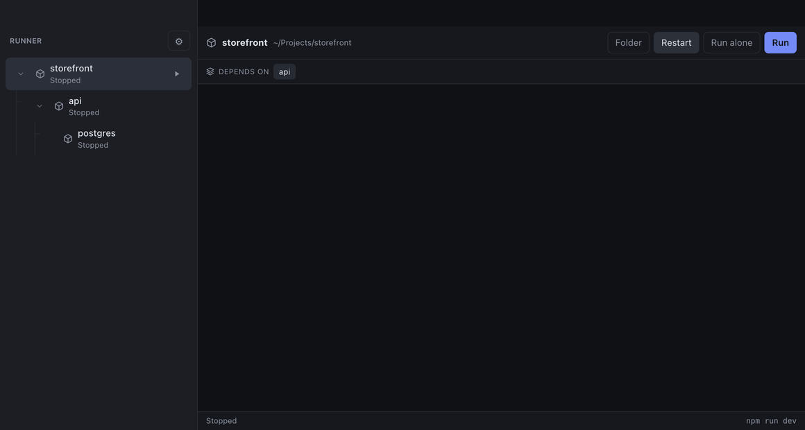
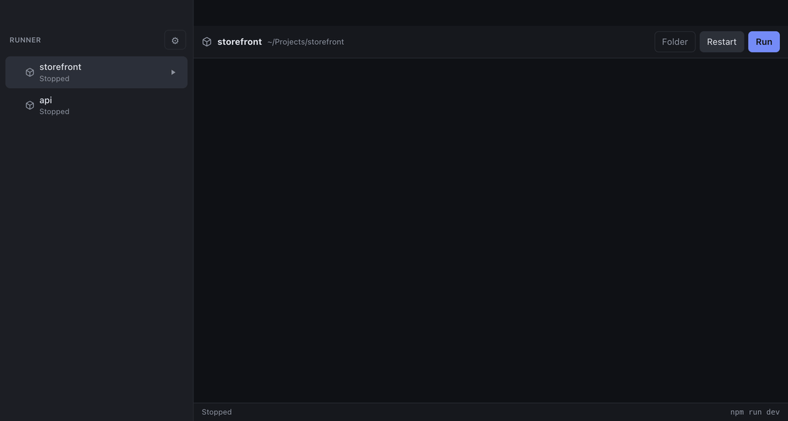

# Runner

A macOS app for starting, restarting and stopping your local dev servers from
one window. Each project gets a real terminal, a port it is allowed to use, and
a link that opens it in your browser.

**[Download for macOS →](https://github.com/dzhiganov/runner/releases/latest)**



Projects can depend on each other, so one click brings up a whole stack in the
order it actually needs to come up in. Nothing runs in a background you can't
see: every project is a real pseudo-terminal you can type into.

---

## Running something

Click Run. The command goes to your login shell, in the project's directory,
with a free port in `PORT`. Output streams into a real terminal — colours,
spinners and progress bars behave exactly as they do in iTerm, because it *is* a
terminal, not a log pane.


`port` is the list of ports a project is allowed to use. Runner walks it in
order and exports the first free one as `PORT`, which Next.js, Vite, CRA,
Express and Nest all pick up with no extra configuration.

The list is authoritative. If every entry is taken, Runner does **not** invent a
port outside it — Run is disabled and hovering it says which ports are occupied.
Availability is re-checked every few seconds while a project is stopped, so the
button re-enables on its own once something frees up.

A port counts as busy if anything accepts a TCP connection on it, or if the
wildcard address cannot be bound. Both checks are needed: Node sets
`SO_REUSEADDR`, so a bind probe alone reports a port as free while another dev
server is happily listening on it.

### Ports Runner did not assign

`PORT` only ever describes one server. Commands that start several at once — an
Nx `run-many`, a monorepo dev script — ignore it, and so do tools that hard-code
their port. For those, Runner reads the ports out of the command's own output:
any `http://localhost:4200/` it prints becomes a link in the toolbar and the
sidebar. Detected ports win over the assigned one, because they are what is
actually listening.

---

## Projects that need other projects

`dependsOn` lists the projects that have to be up first. Run on a project starts
the whole tree, deepest first, and the sidebar shows it as a tree —
dependencies nested under whatever needs them, foldable.



The waiting is the point. A frontend that boots while its backend is still
binding a port fails in ways that look nothing like the real problem, so a
dependent is not started until its dependencies are not merely spawned but
actually answering.

How "ready" is decided, most specific first:

1. `readiness.logPattern` — a regular expression matched against the output.
2. `readiness.port` — wait until that TCP port accepts a connection.
3. Otherwise the port Runner assigned via `PORT`.
4. With nothing to probe, ready once it has survived its first moment.

A timeout is a warning, not a failure: the dependency is up, Runner just could
not prove it is serving, so the dependent starts anyway. A dependency that
genuinely *fails* aborts the tree, and every project in it says which dependency
broke.

Stop takes the tree down too — except any dependency another running project
still needs. **Run alone** and **Stop only** skip the tree entirely, for when
the dependencies are already up somewhere else. Cycles are refused when you
save, naming the loop.

---

## Restarting

Restart stops the project, waits for it to actually let go of its ports, and
only then starts it again.


That wait is not padding. A dev server keeps its listening socket for a moment
after the shell it was spawned through is gone, so restarting the instant the
terminal exits hits the project's own leftover listener and reports every port
as busy — which is why restarting used to take two clicks.

Stopping sends `SIGTERM` to the child's whole **process group**, escalating to
`SIGKILL` after four seconds, so `npm run dev` takes vite, tsc and nodemon down
with it instead of orphaning them on the port.

### After a crash

Turn on **Restart automatically** and a project that falls over comes back by
itself, with a delay that doubles each attempt.


Only unexpected exits count. A stop you asked for, a restart, and a clean exit
are all taken at their word — nothing comes back.

Attempts are *consecutive*, and a run that stays up for twenty seconds resets
the budget. So a project that crashes once a day is restarted every time, while
one that cannot start at all gives up after three tries instead of looping
forever. Each attempt is announced in the terminal and counted in the sidebar,
so a crash loop is visible rather than merely noisy.

---

## Opening the browser

Turn on **Open in the browser once it answers** and Runner opens the project's
URL when it starts — but only once a port genuinely accepts a connection, not
when the process spawns. A browser pointed at a dev server two seconds before it
binds shows a connection error, and you are left refreshing a tab wondering
whether anything happened.

The port it opens is the first one the project announced in its own output,
falling back to the one Runner assigned. If nothing answers within ninety
seconds it says so and opens nothing.

---

## Things you started yourself

Runner used to know only what it had started. A dev server you launched by hand
in a terminal left its project looking stopped while its port was mysteriously
busy.

```text
api
🟡 Running · External · :4931 · pid 94289
```

Every few seconds Runner asks the system what is listening, and attributes each
listener to the project whose directory it is working in. Those show as
**External**, in amber rather than green: a project answering on its port is
good news either way, but Stop and Restart do not mean what they usually mean
when Runner is not the one running it. Its ports are still offered as links,
and Run still says the port is in use — pressing it offers to take the process
down, since its directory matches a project you have configured.

Ownership is decided per project, not per process id. The thing on the port is
a grandchild of the login shell Runner spawned, so its pid was never one Runner
recorded; what Runner does know is which projects it is currently running, and
anything in such a project's directory is its own.

Listeners that match no configured project are ignored. Reporting everything on
the machine would make this a system monitor — the question being answered is
"is my project already up", which is only meaningful about projects Runner
knows. Ports below 1024 are ignored for the same reason.

---

## Worktrees

Each project shows the branch it is checked out on, and what state that
checkout is in:

```text
consumer-app
🌿 main                       Stopped

consumer-gc
🌿 feat/GC-123  ✎3 ↑2         Stopped
```

`✎3` is files changed, counting untracked ones. `↑2` and `↓1` are commits ahead
of and behind the upstream. A clean checkout that is level with its upstream
shows none of this — the decoration is there so the projects that need
attention are the ones that stand out.

A branch with no upstream shows no arrows at all, rather than `↑0 ↓0`. Having
nowhere to push is a different thing from being up to date, and reading it as
the second would be worse than saying nothing.

Two checkouts of one repository are recognised as the same repository, not as
unrelated projects. Identity is the shared git directory rather than the path —
which is what a worktree actually has in common with its main checkout. Hovering
the branch names the repository and how many worktrees it has.

A detached checkout shows its commit instead of a branch. Bare repositories are
ignored: there is no working copy to run anything in.

Git is read on a slow cycle and cached, refreshing when the window regains
focus. Shelling out to `git` is far more expensive than anything else the
sidebar does, and a branch changes on a human timescale.

Runner reads worktree state; it does not create, move or remove worktrees.

---

## When a port is taken

If every port a project is allowed to use is occupied, Run becomes **Port in
use**. Pressing it says who is holding them:

```text
Port 3000 is already in use

:3000            squatter
🟡 Another       node run.js
   project       PID 48192 · ~/projects/old-api      [Kill & Start]
```

What is offered depends on what the process turns out to be:

| | | |
| --- | --- | --- |
| 🟢 | **Started by Runner** | Stop & Start — stopped through the orchestrator, so its dependency tree and auto-restart budget are handled the way a deliberate stop always is |
| 🟡 | **Another project** | Kill & Start — not Runner's process, but its working directory matches a project you have configured |
| 🔴 | **Unknown process** | No kill offered |

A process Runner cannot identify is one it will not kill. That covers anything
whose directory matches nothing you have configured, and anything belonging to
another user, where the system will not say what it is.

Freeing a port waits for the process to actually exit and then for the port to
come back before starting anything — a listening socket outlives its process
briefly, which is the same reason Restart waits.

### What gets signalled

The process on the port, with `SIGTERM` escalating to `SIGKILL` after four
seconds. Its process **group** is only signalled when that process leads the
group itself. A group it merely belongs to is somebody else's — an interactive
shell's job, a parent script — and taking that down because a port was busy
would be far worse than leaving an `npm` wrapper behind after its child dies.

This only applies when *every* listed port is taken. When the first is busy and
a later one is free, Runner still just uses the free one and says so.

---

## Finding your projects

Rather than writing every project into the config by hand, point Runner at the
folders you keep code in and let it look.

The magnifying glass in the sidebar scans each root and lists what it found:

```text
6 projects found

☑ api               Node.js · yarn      yarn start
☑ consumer-app      Node.js · pnpm      pnpm dev
☑ storefront        Node.js · npm       npm run dev
☐ mocks             Node.js · yarn      no command found
☐ legacy-scripts    Git repository      no command found

[Add selected]
```

A directory counts as a project when it has a `.git` or a `package.json`. The
package manager comes from the lockfile — `pnpm-lock.yaml`, `yarn.lock`,
`bun.lockb`, `package-lock.json` — which is also what decides whether the
command is spelled `pnpm dev` or `npm run dev`.

The suggested command is the first long-running script the project has: `dev`,
then `start`, `serve`, `develop`, `watch`. A project whose scripts all exit —
only `build` and `lint`, say — gets no suggestion and starts unticked, because
adding it would put something in the sidebar that cannot run. It can still be
added and given a command afterwards.

Ports are deliberately **not** assigned. Runner would only be guessing, and a
project with no port list is already handled — it simply runs without one being
managed. Add a `port` list per project once you know what it should be.

### What it does not do

A directory that is itself a project is not descended into, so a monorepo is
offered once rather than as its eight `packages/*`. `node_modules` is never
walked. The scan goes two levels below each root, which is enough for
`~/Projects/work/api` and shallow enough not to trawl your home directory.

Projects already in the config are left out, so scanning again answers "what is
new" rather than listing everything a second time.

Worktrees of a repository you have already added are offered too, wherever on
disk they live and whether or not a scan root covers them. Having added one
checkout, its siblings are the likeliest thing you want next. They are named
after their directory rather than their `package.json`, because every checkout
of a repository shares one package name and the directory is what tells them
apart.

---

## Reading the logs

Each project has its own terminal, which is the right tool for interacting with
one process. It is the wrong one for "which of my seven services just threw
that error", so **All logs** in the sidebar merges every project's output into
one stream.

```text
20:28:38  api       ready on http://localhost:4300
20:28:38  api       200 GET /products?page=1
20:28:38  frontend  frontend booting
20:28:39  api       ERROR database connection refused
20:28:39  admin     Compiled successfully
```

Search matches across every service at once. The **Errors** and **Warnings**
tabs narrow by level, and the chips under the toolbar narrow by project; the
two combine.

A line's level comes from its colour first and its text second. A dev server
that paints a line red has said what it means more directly than any pattern
match can infer, so that wins; failing that, `ERROR`, `npm ERR!`, `FATAL`,
`WARN` and friends are matched as whole words. Deliberately as whole words:
`error` appears inside `errorHandler.ts` and in `webpack compiled with no
errors`, and colouring those red would make the filter useless.

**Following** is on until you scroll up, and the button turns it off entirely.
New output keeps being collected while it is paused — pausing stops the view
moving, not the recording.

Copy puts the visible lines on the clipboard; Export writes them to a file.
Both take what the filters currently show, not the whole buffer.

The merged view holds 20,000 lines and drops the oldest beyond that. It is not
written to disk, so it starts empty each launch.

---

## Settings

Every project is configured from a form, with a **Raw JSON** tab for when that
is quicker. Both are validated before anything is written to disk.



Projects live in a single file at
`~/Library/Application Support/runner/projects.json`, seeded with an example on
first launch.

```json
{
  "projects": [
    {
      "id": "4369dbab-cb83-4fed-94ca-25be88fbf808",
      "name": "storefront",
      "path": "~/Projects/storefront",
      "runCommand": "npm run dev",
      "port": [3000, 3001, 3002],
      "autoOpen": true,
      "autoRestart": { "enabled": true },
      "env": { "NODE_ENV": "development" }
    }
  ],
  "scanRoots": ["~/Projects", "~/Work"]
}
```

`scanRoots` is the list of folders the project scan walks. It is written for
you when you add a folder in the discovery dialog, and is the only top-level
key besides `projects`.

| Field | Required | Meaning |
| --- | --- | --- |
| `id` | auto | Stable identifier; generated for you if missing. |
| `name` | yes | Shown in the sidebar. Must be unique. |
| `path` | yes | Project directory. `~` is expanded. |
| `runCommand` | yes | Passed to the shell, e.g. `npm run dev`. |
| `port` | no | Allowed ports, tried in order. Omit to not manage ports. |
| `dependsOn` | no | Ids of projects to start first, and wait for. |
| `readiness` | no | How dependents know this project is up. |
| `autoOpen` | no | Open in the browser once it answers. |
| `autoRestart` | no | `{ enabled, maxAttempts, delayMs }`, or `true` for the defaults. |
| `protocol` | no | `http` (default) or `https`, for the browser links. |
| `env` | no | Extra environment variables for the child process. |
| `shell` | no | Shell to run the command with. Defaults to your login shell. |
| `cwd` | no | Working directory override. Defaults to `path`. |

### Which shell your commands run in

Your **login shell**, from the passwd database — the one `chsh` sets — as a
login and interactive shell, so `nvm`/`fnm`/`asdf` shims resolve exactly as they
do when you type the command yourself.

Deliberately not `$SHELL`: launchd does not set it for apps opened from Finder
or the Dock, and anything that does launch Runner with one passes on its own
rather than yours. Picking the wrong shell gives the command a different `PATH`,
and possibly a different `node`, than the terminal you tested it in. Whichever
is being used is printed in the terminal header on every run.

### Shortcuts

| Key | Action |
| --- | --- |
| `⌘R` | Restart the selected project |
| `⌘.` | Stop the selected project |
| `⌘,` | Edit configuration |

---

## Installing

Download the `.dmg` from the [releases page](https://github.com/dzhiganov/runner/releases/latest). **Apple
Silicon only** (M1 or newer) — on an Intel Mac, build from source.

Drag `Runner.app` to `/Applications`, then clear the quarantine flag once:

```bash
xattr -cr /Applications/Runner.app
```

Skip that and macOS claims the app "is damaged". It is not. The build is ad-hoc
signed rather than notarised by Apple, and macOS refuses to launch a
non-notarised app that arrived from another machine until the quarantine
attribute is cleared. Right-click → Open does **not** work around this; the
`xattr` command does. Removing the warning for good would need a paid Apple
Developer ID and per-build notarisation.

---

## Running it yourself

```bash
npm install     # rebuilds node-pty against Electron automatically
npm run dev     # hot-reloading dev build
```

```bash
npm test          # process, port and config suite — spawns real processes
npm run typecheck
npm run build
npm run dist:dmg  # packaged .dmg in ./release
```

`npm test` binds ports 3000–3002, 3010–3017 and 3020–3023 while it runs.

---

## How it's built

Electron, React and TypeScript in strict mode, with `node-pty` for the terminals,
xterm.js for rendering them, and electron-vite for the build. One runtime
dependency — the icon set is inline SVG rather than a package.

```
src/
  main/                 Electron main process
    index.ts            window, IPC, quit handling
    process-manager.ts  PTY lifecycle: start/stop/restart, group kill, buffers
    orchestrator.ts     dependency trees: topological start, readiness, tree stop
    ports.ts            free-port detection, fallback, release waits, probes
    config.ts           read/write the JSON file
    config-validate.ts  pure validation and migration, no Electron import
  preload/index.ts      contextBridge API exposed to the renderer
  renderer/src/         sidebar, toolbar, terminal host, settings editor
  shared/               types, and the dependency graph all three layers agree on
```

The renderer never touches a PTY. It sends intents — start, stop, restart — and
receives runtime snapshots plus output, which keeps the process lifecycle in one
place instead of spread across the UI.

`config-validate.ts` deliberately imports nothing from Electron, so validation
and migration are unit-testable on their own. `test/e2e.ts` spawns real
processes against fixture dev servers and asserts against real ports: that a
restart survives the project still holding its own port, that a failing
dependency aborts a tree, that a stop reaches every child in the group.

---

## Licence

MIT. See [LICENSE](LICENSE).
